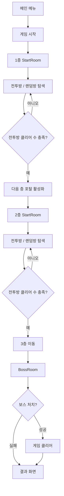

# Chalice of Reborn

> 고딕풍 분위기의 3인칭 액션 로그라이크 게임 프로젝트

`Chalice of Reborn`은 방 단위 진행 구조를 기반으로,
어두운 고딕 분위기와 양손 무기 전투를 결합한 3인칭 액션 로그라이크 게임입니다.

플레이어는 지하 성소를 탐색하며 전투방을 클리어하고,
유물과 아이템을 획득해 성장하며, 최종적으로 보스를 처치하는 것을 목표로 합니다.

---

## 목차

- [프로젝트 개요](#프로젝트-개요)
- [게임 컨셉](#게임-컨셉)
- [게임 진행 흐름](#게임-진행-흐름)
- [필수 구현 과제 반영](#필수-구현-과제-반영)
- [도전 기능 반영](#도전-기능-반영)
- [주요 구현 시스템](#주요-구현-시스템)
    - [Game Flow](#game-flow)
    - [Room System](#room-system)
    - [Level Streaming](#level-streaming)
    - [Character System](#character-system)
    - [Animation System](#animation-system)
    - [Combat System](#combat-system)
    - [Enemy AI](#enemy-ai)
    - [Inventory System](#inventory-system)
    - [UI System](#ui-system)
    - [Level Design](#level-design)
- [트러블 슈팅](#트러블-슈팅)
- [기술 스택](#기술-스택)
- [향후 개선 방향](#향후-개선-방향)

---

## 프로젝트 개요

| 항목 | 내용 |
| --- | --- |
| 프로젝트명 | Chalice of Reborn |
| 장르 | 3인칭 액션 로그라이크 |
| 엔진 | Unreal Engine 5 |
| 개발 언어 | C++ / Blueprint |
| 핵심 키워드 | 로그라이크, 고딕 액션, 양손 무기, 레벨 스트리밍, AI, 인벤토리, UI |

---

## 게임 컨셉

`Chalice of Reborn`은
**건파이어 리본의 방 단위 로그라이크 진행 구조**와
**블러드본풍의 어둡고 묵직한 고딕 분위기**를 결합한 게임입니다.

초기 기획에서는 단방향 방 선택형 로그라이크 구조를 목표로 했으며,
최종 구현에서는 `StartRoom`을 중심으로 여러 방이 배치되는 허브형 구조로 발전시켰습니다.

플레이어는 근접 무기와 총을 함께 사용하며,
전투방을 클리어하고 아이템을 획득해 성장한 뒤 보스방에 도달하게 됩니다.

---

## 게임 진행 흐름

---

## 필수 구현 과제 반영

프로젝트에서 요구한 필수 과제를 기준으로 다음 기능들을 구현했습니다.

### 게임 모드

- 게임 시작 및 종료 흐름 처리
- 방 클리어 조건 관리
- 보스 처치 시 게임 클리어 처리
- 사망 시 결과 화면 전환
- 층 전환 흐름 관리
- 방 클리어 수에 따른 포탈 활성화

### UI 시스템

- 체력 UI 표시
- 스태미너 UI 표시
- 무기 및 탄약 정보 표시
- 크로스헤어 표시
- 데미지량 팝업 표시
- 방 진행도 UI 표시
- 보스 체력 UI 표시
- 결과 화면 구성

### 캐릭터 이동 및 상태 변화

- 키보드 / 마우스 기반 이동 및 시점 조작
- 걷기, 달리기, 점프 구현
- 대쉬 회피 구현
- 조준 상태 전환
- 록온 상태 전환
- 전투 상태에 따른 이동 제한
- 상황별 애니메이션 재생

### 전투 로직

- 근접 약공격 3단 콤보
- 근접 강공격 2단 콤보
- 원거리 사격
- 재장전 처리
- 스태미너 기반 행동 제한
- Sphere Trace 기반 근접 판정
- Projectile 기반 원거리 판정
- 피격 및 사망 처리
- 데미지 인터페이스 기반 공통 피해 처리

### 적 AI

- `ACharacter` 기반 EnemyBase 구현
- 일반 미니언, 엘리트 미니언, 보스 구성
- 체력 및 공격 처리
- 피격 / 사망 처리
- 플레이어 탐지
- 플레이어 추적
- 공격 범위 내 공격
- AIController 기반 AI 제어
- Behavior Tree / Blackboard 기반 행동 처리
- NavMesh 기반 이동
- MoveTo 실패 시 이동 보정 처리

---

## 도전 기능 반영

필수 과제 외에도 프로젝트 완성도를 높이기 위해 일부 도전 기능을 구현했습니다.

### 인벤토리 시스템

- DataTable 기반 아이템 데이터 관리
- 인벤토리 슬롯 UI 구성
- 아이템 상세 정보 표시
- 재료 아이템과 패시브 아이템 구분
- 아이템 강화 기능
- 강화 성공 시 아이템 이름과 효과 수치 갱신

### 보스전 시스템

- 보스 캐릭터 구현
- 보스 전용 체력 UI 표시
- 보스 공격 패턴 구성
- 보스 처치 시 게임 클리어 처리
- 보스 사망 예외 처리

### 아이템 강화 시스템

- 강화 재료 보유 여부 검사
- 재료 부족 시 알림 표시
- 강화 성공 UI 출력
- 강화 결과를 아이템 데이터에 반영

### 레벨 디자인 확장

- StartRoom 기반 허브형 방 구조 구현
- BattleRoom / RandomRoom / BossRoom 구성
- 방과 통로를 Level Streaming으로 배치
- Vertex Painting 기반 고딕풍 레벨 표현

---

## 주요 구현 시스템

---

## Game Flow

게임의 전체 흐름은 `GameMode`, `GameState`, `GameInstance`를 중심으로 구성했습니다.

| 클래스 | 역할 |
| --- | --- |
| GameMode | 게임 시작, 종료, 층 전환, 클리어 흐름 관리 |
| GameState | 현재 방 상태, 클리어 수, 포탈 활성화 조건 관리 |
| GameInstance | 레벨 전환 이후에도 유지되어야 하는 플레이어 데이터 저장 |

`OpenLevel`로 층이 바뀌더라도
플레이어의 HP, 스탯, 무기, 탄약, 인벤토리 정보가 유지되도록 `SessionData`를 저장하고 복원했습니다.

---

## Room System

방 구조는 `StartRoom` 중심의 허브형 구조로 구현했습니다.

1층과 2층은 다음과 같이 구성됩니다.

- StartRoom
- BattleRoom
- RandomRoom

전투방을 일정 수 이상 클리어하면
StartRoom에 다음 층으로 이동하는 포탈이 활성화됩니다.

3층은 보스방 중심 구조로 구성했습니다.

- StartRoom
- BossRoom

각 방은 상태 기반으로 관리됩니다.

| 상태 | 설명 |
| --- | --- |
| Waiting | 대기 상태 |
| Prepared | 입장 전 준비 상태 |
| InProgress | 전투 진행 상태 |
| Cleared | 클리어 완료 상태 |

---

## Level Streaming

층 단위 전환은 `OpenLevel`로 처리하고,
각 층 내부의 방과 통로는 `Level Streaming`으로 동적으로 배치했습니다.

`LevelLayoutManager`는 다음 역할을 담당합니다.

- StartRoom 배치
- BattleRoom 배치
- RandomRoom 배치
- BossRoom 배치
- 방과 통로 연결
- 스트리밍 레벨 로드 관리

이를 통해 층 전환 로직과 방 배치 로직을 분리했습니다.

---

## Character System

플레이어 캐릭터는 3인칭 액션 게임에 필요한 조작을 중심으로 구현했습니다.

### 주요 기능

- 카메라 기준 이동
- 마우스 시점 조작
- 점프
- 달리기
- 대쉬
- 조준
- 사격
- 재장전
- 록온
- 아이템 상호작용

대쉬는 `CombatComponent`와 연계하여 전투 상태에 따라 실행되며,
대쉬 중에는 마찰과 감속 값을 조정해 빠르게 미끄러지는 느낌을 구현했습니다.

조준 시에는 카메라 FOV와 숄더뷰 오프셋을 조정하여
TPS 조준 느낌을 강화했습니다.

---

## Animation System

캐릭터의 상태에 따라 서로 다른 애니메이션이 재생되도록 애니메이션 시스템을 구성했습니다.

플레이어 캐릭터는 이동, 조준, 록온, 공격, 대쉬, 피격, 사망 등
현재 상태에 맞는 애니메이션을 재생하도록 구현했습니다.

### 플레이어 애니메이션

- Idle / Walk / Run 애니메이션
- 조준 상태 애니메이션
- 록온 상태 애니메이션
- 대쉬 애니메이션
- 근접 공격 몽타주
- 사격 애니메이션
- 재장전 애니메이션
- 피격 애니메이션
- 사망 애니메이션

### 상태별 애니메이션 처리

캐릭터의 이동 속도, 조준 여부, 록온 여부, 전투 상태를 기준으로
상황에 맞는 애니메이션이 재생되도록 구성했습니다.

예를 들어 일반 이동 중에는 이동 Blend Space를 사용하고,
조준 중에는 조준 전용 애니메이션을 사용하며,
록온 중에는 타겟을 바라보는 상태에 맞는 애니메이션을 사용했습니다.

공격, 대쉬, 재장전, 피격, 사망처럼 특정 동작이 필요한 경우에는
Animation Montage를 사용해 상태별 액션을 재생했습니다.

### AnimNotify 활용

공격 판정, 사운드 재생, 콤보 입력 가능 시점처럼
애니메이션의 특정 프레임에 맞춰 실행되어야 하는 기능은 `AnimNotify`를 활용했습니다.

이를 통해 애니메이션과 실제 게임 로직의 타이밍이 어긋나지 않도록 처리했습니다.

---

## Combat System

전투 시스템은 컴포넌트 기반으로 역할을 분리했습니다.

| 컴포넌트 | 역할 |
| --- | --- |
| StatComponent | HP, 공격력, 방어력, 스태미너 등 전투 수치 관리 |
| WeaponComponent | 장착 무기 관리 |
| CombatComponent | 공격, 회피, 재장전, 피격, 사망 상태 관리 |
| MeleeCombatComponent | 근접 공격 실행 |
| RangedCombatComponent | 원거리 공격 실행 |

### 근접 전투

근접 전투는 `AnimMontage Section`과 `AnimNotifyState`를 활용했습니다.

- 약공격 3단 콤보
- 강공격 2단 콤보
- 입력 타이밍 기반 콤보 연결
- 공격 가능 구간 Notify 처리
- 콤보 입력 가능 구간 Notify 처리
- 무기 소켓 기반 Sphere Trace 판정

### 원거리 전투

원거리 전투는 카메라 조준점과 총구 위치를 기준으로 발사 방향을 계산했습니다.

- 조준 중 사격
- Projectile 발사
- 탄약 관리
- 재장전 처리
- 충돌 시 ApplyDamage 호출

---

## 적 AI

적 AI는 `ACharacter`를 상속한 `EnemyBase`를 기반으로 구현했습니다.

모든 적 캐릭터는 `EnemyBase`를 부모 클래스로 사용하며,
일반 미니언, 엘리트 미니언, 보스는 이를 기반으로 각각 필요한 기능을 확장했습니다.

### 주요 구조

- EnemyBase
- AIController
- Behavior Tree
- Blackboard
- Animation Montage
- AnimNotify
- AI Perception
- NavMesh

### EnemyBase

`EnemyBase`는 적 캐릭터의 공통 기능을 담당합니다.

주요 기능은 다음과 같습니다.

- 체력 관리
- 공격 처리
- 피격 처리
- 사망 처리
- 공격 범위 충돌 처리
- 애니메이션 몽타주 재생
- 보스 / 미니언 공통 기능 관리

적의 공격 판정은 무기 또는 주먹 위치에 충돌체를 붙이고,
공격 애니메이션의 특정 타이밍에 충돌체를 켜고 끄는 방식으로 처리했습니다.

### AI Controller / Behavior Tree

적의 판단과 행동 흐름은 `AIController`, `Behavior Tree`, `Blackboard`를 사용해 구성했습니다.

`Blackboard`에는 AI가 판단에 사용할 정보를 저장하고,
`Behavior Tree`는 해당 값을 기준으로 대기, 추적, 공격, 피격, 사망 등의 행동을 실행합니다.

### AI 상태

| 상태 | 설명 |
| --- | --- |
| Idle | 플레이어를 발견하지 못한 대기 상태 |
| Chase | 플레이어를 발견하고 추적하는 상태 |
| Attack | 공격 가능 거리에서 공격하는 상태 |
| Hit | 피격 후 경직되는 상태 |
| Dead | HP가 0이 되어 사망한 상태 |

AI는 플레이어와의 거리, 현재 상태, 공격 가능 여부에 따라 행동을 전환합니다.

### 이동 처리

적의 이동은 기본적으로 NavMesh 기반 `MoveTo`를 사용했습니다.

다만 이동 불가능한 위치에서 `MoveTo`가 실패하는 경우가 있어,
일부 상황에서는 직접 이동 보정을 추가해 적이 멈추지 않도록 처리했습니다.

---

## Inventory System

아이템과 인벤토리는 `DataTable` 기반으로 관리했습니다.

### 주요 기능

- 아이템 데이터 관리
- 인벤토리 슬롯 생성
- 아이템 상세 정보 출력
- 재료 아이템 개수 표시
- 패시브 아이템 강화 버튼 표시
- 강화 재료 검사
- 강화 성공 처리
- 강화된 아이템 데이터 갱신

데이터 기반 구조를 사용해
새로운 아이템을 추가하거나 수치를 변경하기 쉽게 구성했습니다.

---

## UI System

UI는 이벤트 기반으로 갱신되도록 구현했습니다.

| UI | 갱신 방식 |
| --- | --- |
| HP UI | StatComponent Delegate |
| Stamina UI | StatComponent Delegate |
| Ammo UI | GunBase Ammo Event |
| 진행도 UI | GameState Event |
| 데미지 팝업 | DamagePopupComponent |

매 프레임 UI를 갱신하지 않고,
값이 변경되는 시점에만 UI를 업데이트하여 불필요한 Tick 의존도를 줄였습니다.

---

## Level Design

레벨 디자인은 고딕풍 분위기와 로그라이크 진행 구조를 함께 고려했습니다.

### 구조

- 1층: StartRoom 중심 허브형 구조
- 2층: StartRoom 중심 허브형 구조
- 3층: BossRoom 중심 구조

### 비주얼

- 어두운 고딕풍 톤
- 벽, 바닥, 기둥 기반 모듈형 구조
- PBR 텍스처 적용
- Vertex Painting으로 이끼와 낡은 흔적 표현
- 방 규격화를 통한 랜덤 배치 기반 마련

---

## 트러블 슈팅

---

## 레벨 스트리밍 로딩 지연 문제

### 문제

Level Streaming으로 방을 로딩하는 과정에서
플레이어가 맵보다 먼저 생성되어 바닥 아래로 낙하하는 문제가 발생했습니다.

### 원인

스트리밍 레벨이 모두 표시되기 전에
플레이어 입력과 중력이 먼저 활성화되었기 때문입니다.

### 해결

모든 스트리밍 레벨의 `OnLevelShown`이 호출된 이후
게임을 시작하도록 처리했습니다.

로딩 중에는 다음 처리를 적용했습니다.

- 로딩 화면 표시
- 플레이어 입력 잠금
- 이동 잠금
- 중력 비활성화
- 레벨 로딩 완료 후 잠금 해제

### 결과

플레이어 낙하 문제를 방지했고,
로딩 화면을 통해 자연스럽게 레벨 진입이 이루어지도록 개선했습니다.

---

## 기술 스택

| 분류 | 사용 기술 |
| --- | --- |
| Engine | Unreal Engine 5 |
| Language | C++ |
| Visual Scripting | Blueprint |
| AI | Behavior Tree, Blackboard, AI Perception |
| Animation | Animation Blueprint, Blend Space, AnimMontage, AnimNotify |
| Level | OpenLevel, Level Streaming |
| UI | UMG |
| Data | DataTable |
| Collision | Sphere Trace, Projectile, Collision Component |
| VFX | Niagara, GeometryCollection |
| Design | Vertex Painting, PBR Material |

---

## 향후 개선 방향

이번 프로젝트에서 핵심 플레이 흐름은 구현했지만,
다음 기능들은 향후 개선 과제로 남았습니다.

- 절차적 던전 생성 알고리즘 고도화
- 방 구조 다양화
- 패링 시스템 추가
- 총과 근접 무기의 동시 사용 액션 구현
- 보스 2페이즈 구현
- AI 행동 패턴 다양화
- MoveTo 실패 상황에 대한 예외 처리 강화
- UI 갱신 구조 개선
- POM 기반 표면 요철 표현 추가
- 시네마틱 연출 추가
- 라이팅과 가시성 개선

---

## 프로젝트 정리

`Chalice of Reborn`은 단순히 개별 기능을 구현하는 데 그치지 않고,
게임 진행, 전투, UI, AI, 인벤토리, 레벨 디자인을 하나의 플레이 경험으로 연결하는 것을 목표로 한 프로젝트입니다.

StartRoom 기반 허브형 방 구조,
Level Streaming을 활용한 방 로딩,
컴포넌트 기반 전투 구조,
Behavior Tree 기반 AI,
DataTable 기반 인벤토리,
Vertex Painting 기반 고딕풍 레벨 표현을 통해
3인칭 액션 로그라이크 게임의 핵심 흐름을 구현했습니다.
